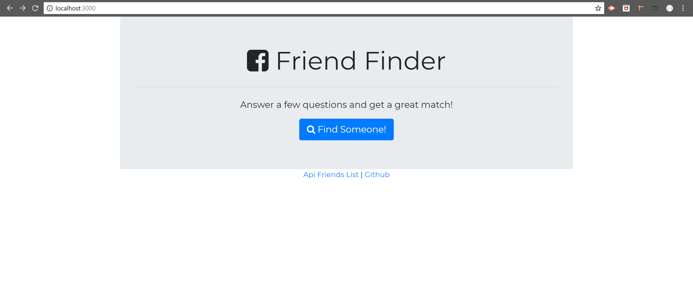
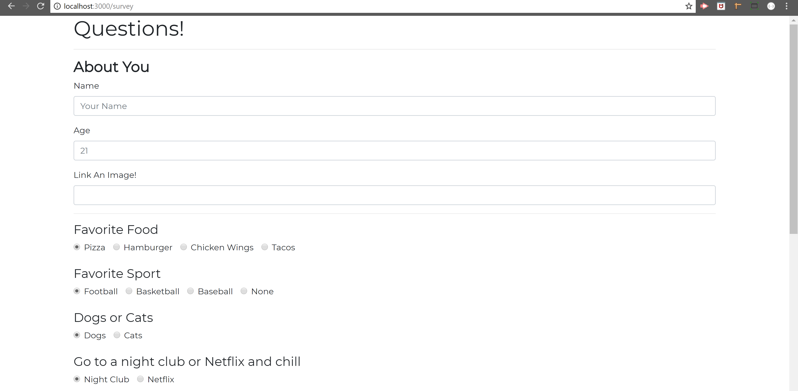
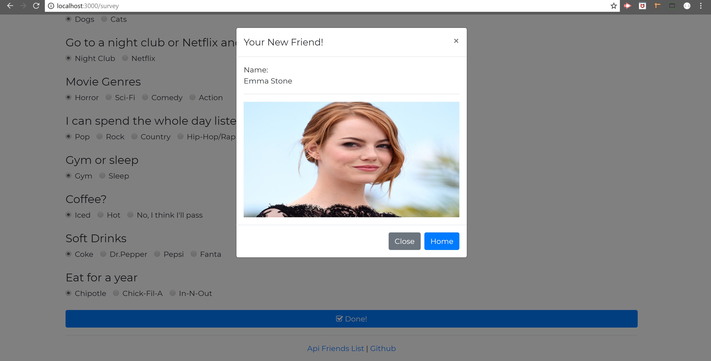

# Friend Finder Application

This is a basic version of a friend matching application.

### Technologies used:
* Node.js
* Express
* Javascript

## Home Page
This is the home page of the application and as you can see the URL is http://localhost:3000 wich means that the app is online running with the Express server we created. It has 3 buttons, Find Someone will take you to a new HTML document where you will be able to fill a form and answer some questions! With the Api Friends List you will be able to see the current list of friends the server has. 

## Survey
In this part of the application you will be able to fill a form and answer some questions that later will create a new JSON Object and will be available for future matches, if the user goes to the  Friend Api link they will be able to see the recently added JSON Object.

## Match
After successfully filling and clicking the Done button, a dynamically generated modal will apear on the screen with the user match.

